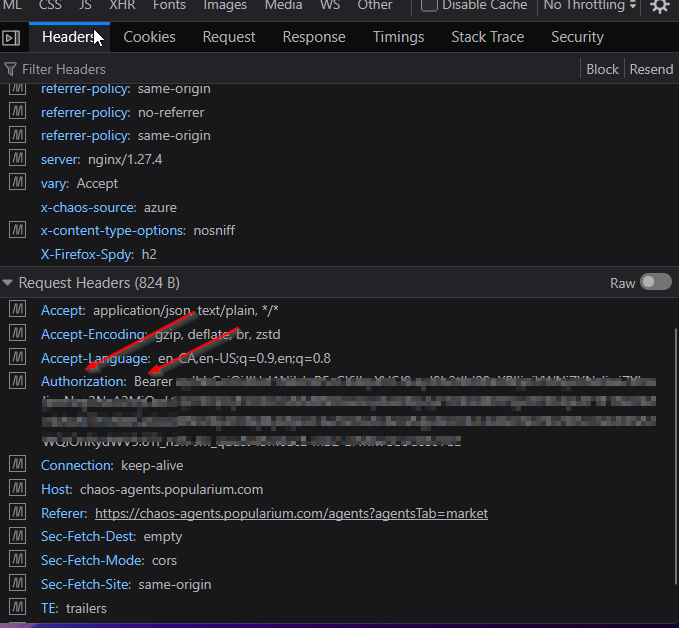

# Chaos Agents Build Finder

A tool for searching any agent, available or under contract, by the skills you want.
Filter by skills with AND/OR logic, browse a full skills catalogue, save favorites, and
see matches sorted by build cost. It runs entirely on your own computer. Nothing is
uploaded anywhere and it never needs your password.

## Download

| System | Download |
|--------|----------|
| Windows | [Chaos-Finder-Windows.zip](../../releases/latest/download/Chaos-Finder-Windows.zip) |
| Mac | [Chaos-Finder-Mac.zip](../../releases/latest/download/Chaos-Finder-Mac.zip) |

## Install Python first

The app needs Python to run. Do this once, before anything else.

1. Go to https://www.python.org/downloads/ and download Python 3.14 for Windows.
2. Open the installer. On the very first screen, check the box that says
   **Add python.exe to PATH** at the bottom. This step is easy to miss and the app
   will not start without it.
3. Click Install Now and let it finish.
4. To confirm it worked, open the Start menu, type `cmd`, open Command Prompt, type
   `python --version`, and press Enter. You should see `Python 3.14.x`. If you instead
   see an error or the Microsoft Store opens, Python was not added to PATH. Re-run the
   installer, choose Modify, and make sure Add to PATH is checked.

## Setup

5. Download the `.zip` from the [Releases](../../releases/latest) page and extract the
   whole folder to wherever you want to keep it. Do not separate or remove any of the
   files inside the folder.
6. Double-click the `.bat` file. A terminal window opens and your browser launches the
   app. Leave the terminal open while you use it.

### Get your login token

7. Go to https://chaos-agents.popularium.com/agents?agentsTab=market
8. Right-click anywhere and choose Inspect.
9. Select the Network tab and refresh the page.
10. Find a GET response like the one below and click it.

    

11. In the Headers, find your Authorization token and copy it. Do not copy the word
    "Bearer", just the token itself.

    

12. Paste the token into the login token box in the app and click Refresh available
    agents. It runs for a bit, and you can watch the progress in the terminal window.

## Using the finder

On the left, click Add another requirement to add a skill you want to include. This is
how the AND/OR logic works. Put multiple skills in the same requirement to match an
agent that has any one of them (OR). Click Add another requirement to start a new bucket,
and the agent has to satisfy every bucket (AND).

You can set a max position per skill, so a skill only counts if it sits at that
column-depth or shallower.

The results always sort by total build cost.

Underneath the skills you can filter by favorites, only available agents, skills, or
classes.

To view an agent, click its name, then press Ctrl + V to paste the name into the game's
search box.

To see every skill in one place, select Skills Catalogue at the top. You can filter it
by class, trigger, and cost.

## Notes

Keep all the files in the folder together. The app loads its data from the other files
next to it.

Your token is stored only on your computer and is used only to talk to the game's own
API. It never leaves your machine, and it is not included in the download.

After a game balance patch, click Refresh again and the skill values update.
